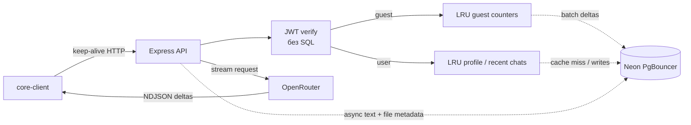

# core-server

Express API для Hermes/core-client: JWT-авторизация, гостевой недельный лимит,
история зарегистрированных пользователей в Neon PostgreSQL и NDJSON-stream из
OpenRouter. Файлы проходят только в оперативной памяти запроса и в БД не
записываются.

## Архитектура



Один Express-процесс держит небольшой `pg.Pool`, а `DATABASE_URL` указывает на
Neon endpoint с `-pooler` (PgBouncer transaction mode). На старте выполняется
`SELECT 1`, чтобы первый пользовательский запрос не оплачивал создание TCP/TLS
соединения. Ответ модели запускается параллельно записи пользовательского
сообщения; сохранение assistant-сообщения выполняется после окончания потока и
не задерживает клиентский `done`.

Express выбран вместо Fastify: в этом приложении end-to-end latency определяется
Neon/OpenRouter и первым токеном модели, а не маршрутизацией нескольких
middleware. Переезд существующего Express-контракта ради долей миллисекунды не
даёт ощутимого выигрыша. Горячий путь ускорен там, где эффект заметен: JWT без
SQL, LRU, reused DB connections, cursor pagination и отсутствие промежуточного
Next proxy при заданном `NEXT_PUBLIC_CORE_API_URL`.

## Эндпоинты

| Метод | Путь | Авторизация | Назначение |
|---|---|---|---|
| `POST` | `/api/auth/register` | нет | Пользователь + 2–3 survey-ответа одной транзакцией |
| `POST` | `/api/auth/login` | нет | Argon2id verify, access/refresh cookies |
| `POST` | `/api/auth/refresh` | refresh cookie | Одноразовая ротация refresh token |
| `POST` | `/api/auth/logout` | нет | Отзыв refresh token и очистка cookies |
| `GET` | `/api/auth/me` | access JWT | Профиль из LRU/БД |
| `GET` | `/api/chats?limit&cursor` | access JWT | Чаты, cursor pagination |
| `POST` | `/api/chats` | access JWT | Создать чат |
| `PATCH` | `/api/chats/:chatId` | access JWT | Название/модель |
| `DELETE` | `/api/chats/:chatId` | access JWT | Удалить чат каскадно |
| `GET` | `/api/chats/:chatId/messages?limit&cursor` | access JWT | История сообщений |
| `POST` | `/api/chats/:chatId/messages` | access JWT | Записать текст и/или метаданные файла |
| `POST` | `/api/chat/stream` (`/api/chat` alias) | опционально | AI NDJSON-stream; гостям 5 запросов/неделю |
| `GET` | `/health/live` | нет | Liveness |
| `GET` | `/health/ready` | нет | Readiness с проверкой PostgreSQL |

Stream принимает текущий клиентский формат `model`, `messages`,
`allowFallback` и дополнительные `chatId`, `title`, `assistantMessageId`.
Последние три обязательны только для авторизованного пользователя, потому что
они обеспечивают идемпотентное сохранение истории. Гостевой stream не пишет ни
текст, ни метаданные файлов.

## Запуск

```bash
npm install
psql "$DATABASE_URL" -v ON_ERROR_STOP=1 -f schema.sql
npm run build
npm start
```

Для миграции предпочтителен direct Neon URL, а runtime обязательно должен
использовать pooled URL с `-pooler` в hostname. В актуальном Neon параметр
`pgbouncer=true` больше не нужен; если вы используете старую строку подключения,
его можно оставить.

## Environment

Обязательные:

- `DATABASE_URL` — runtime pooled Neon connection string.
- `OPENROUTER_API_KEY`.
- `JWT_ACCESS_SECRET` — не менее 32 символов.
- `COOKIE_SECRET` — не менее 32 символов.
- `FINGERPRINT_SECRET` — не менее 32 символов, отдельный от cookie/JWT secret.

Обычно задаются в production:

- `NODE_ENV`, `PORT`, `HOST`, `APP_URL`, `CLIENT_ORIGINS`.
- `JWT_ISSUER`, `JWT_AUDIENCE`, `ACCESS_TOKEN_TTL`,
  `REFRESH_TOKEN_TTL_DAYS`, `COOKIE_DOMAIN`.
- `TRUST_PROXY` — включать только за доверенным reverse proxy.
- `DB_POOL_MAX`, `DB_IDLE_TIMEOUT_MS`, `DB_CONNECT_TIMEOUT_MS`.
- `GUEST_WEEKLY_LIMIT`, `GUEST_LIMIT_FLUSH_MS`.
- `CACHE_PROFILE_MAX`, `CACHE_PROFILE_TTL_MS`, `CACHE_CHATS_MAX`,
  `CACHE_CHATS_TTL_MS`, `CACHE_GUEST_MAX`.
- `JSON_BODY_LIMIT`, `OPENROUTER_FIRST_TOKEN_TIMEOUT_MS`,
  `OPENROUTER_IDLE_TIMEOUT_MS`, `OPENROUTER_OVERALL_TIMEOUT_MS`, `LOG_LEVEL`.

Клиенту нужен `NEXT_PUBLIC_CORE_API_URL`. В production самый быстрый и простой
для cookies вариант — reverse proxy `/api` на `core-server` под тем же site.

## Решения, влияющие на latency

- `pg` + маленький process-local pool поверх Neon PgBouncer выбран для
  долгоживущего Express-процесса: прогретые TCP/TLS-соединения переиспользуются,
  а интерактивные транзакции регистрации/refresh не требуют дополнительных HTTP
  round-trips.
- Access JWT (`HS256`) проверяется локально. БД нужна только для login/refresh;
  refresh token хранится как SHA-256 hash и ротируется транзакционно.
- Профили и первые страницы последних чатов лежат в ограниченных TTL-LRU;
  мутации инвалидируют соответствующие ключи.
- Гостя одновременно ограничивают signed-cookie key и HMAC от coarse network +
  browser hints/device-id. Signed quota-cookie хранит достигнутый недельный floor,
  поэтому refresh или рестарт процесса до DB batch не открывает лимит заново.
  Очистка cookie сама по себе не сбрасывает fingerprint-счётчик. Два счётчика
  читаются из LRU, а PostgreSQL получает суммарные дельты батчами.
- При нескольких API-репликах in-memory остаётся самым быстрым, но строгий
  глобальный лимит требует Redis/Valkey с одним Lua `INCR + EXPIRE` на запрос.
  Без Redis возможен небольшой временный oversubscription до следующего DB batch;
  история и auth от этого не зависят.
- Cursor pagination использует `(user_id, updated_at, id)` и
  `(chat_id, created_at, id)` индексы; `OFFSET` отсутствует.
- Brotli/gzip включены для JSON с быстрыми уровнями. NDJSON stream намеренно не
  сжимается и содержит `no-transform`, чтобы компрессор/proxy не буферизовал
  первый токен.
- Pino пишет асинхронно и не логирует тела/секреты. Node `fetch` переиспользует
  keep-alive соединения к OpenRouter; HTTP server keep-alive настроен явно.

## Файлы

- `schema.sql` — самодостаточная схема и индексы.
- `src/routes/auth.ts` — register/login/refresh/logout/me.
- `src/services/guest-limits.ts` — LRU и batch persistence лимитов.
- `src/routes/chats.ts` — история и cursor pagination.
- `src/routes/chat-stream.ts` и `src/services/openrouter.ts` — поток модели и
  неблокирующее сохранение текста/метаданных.
